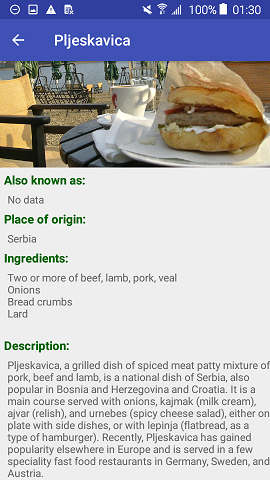

# Sandwich Club Android App
>SandwichClubApp is an android app that allows the users to select a sandwich to show the details of each sandwich. The details are Place of origin, Also Known as, description, and ingredients. 
This project was developed as a part of [Android Developer Nanodegree](https://github.com/udacity/sandwich-club-starter-code)

## What did I Learn?
Through this project, you learned:
- Learn how to submit projects for review
- Practice JSON parsing to a model object
- Design an activity layout
- Populate all fields in the layout accordingly
 
## Sandwich Menu: 

> "Ham and cheese sandwich", "Bosna", "Chivito", "Club sandwich", "Gua bao", "Medianoche", "Pljeskavica", "Roujiamo", "Shawarma", "Vada Pav".

## MIT License

Copyright (c) 2018  Kahina Mouelouel

Permission is hereby granted, free of charge, to any person obtaining a copy of this software and associated documentation files (the "Software"), to deal in the Software without restriction, including without limitation the rights
to use, copy, modify, merge, publish, distribute, sublicense, and/or sell copies of the Software, and to permit persons to whom the Software is furnished to do so, subject to the following conditions:

The above copyright notice and this permission notice shall be included in all copies or substantial portions of the Software.

THE SOFTWARE IS PROVIDED "AS IS", WITHOUT WARRANTY OF ANY KIND, EXPRESS OR IMPLIED, INCLUDING BUT NOT LIMITED TO THE WARRANTIES OF MERCHANTABILITY, FITNESS FOR A PARTICULAR PURPOSE AND NONINFRINGEMENT. IN NO EVENT SHALL THE
AUTHORS OR COPYRIGHT HOLDERS BE LIABLE FOR ANY CLAIM, DAMAGES OR OTHER LIABILITY, WHETHER IN AN ACTION OF CONTRACT, TORT OR OTHERWISE, ARISING FROM, OUT OF OR IN CONNECTION WITH THE SOFTWARE OR THE USE OR OTHER DEALINGS IN THE
SOFTWARE.

## Screenshots

